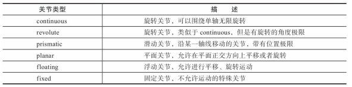
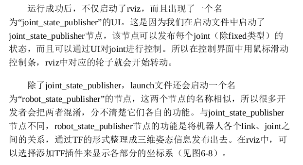

## URDF
* urdf_to_graphiz mrobot_chassis.urdf\
查看URDF整体结构

* check_urdf mrobot_chassis.urdf\
解析URDF文件并发现错误
```xml
<robot> 包含name属性

<link name="base_link"> 连杆的属性
    <visual> 定义外观属性
        <origin xyz=" 0 0 0" rpy="0 0 0" /> 定义起点坐标
        <geometry> 定义几何性质
            <cylinder length="0.005" radius="0.13"/>
                包含length长度属性
                包含radius半径属性
        </geometry>
        <material name="yellow"> 定义材料颜色
            <color rgba="1 0.4 0 1"/>
        </material>
    </visual>
    <inertial> ... </inertial> 物理惯性属性
    <collision> ... </collision> 碰撞属性
</link>

<joint name="base_left_motor_joint" type="fixed"> type属性定义了关节类型
    <origin xyz="-0.055 0.075 0" rpy="0 0 0" />
    <parent link="base_link"/> 上一个link
    <child link="left_motor" /> 下一个link
    <calibration .../> 关节的位置参考，用于校准绝对位置
    <dynamics damping .../> 描述物理属性，阻尼比什么的
    <limit effort .../> 描述极限值，关节上下位限制什么的
    ...
</joint>

<gazebo reference="link_1"> 仿真用的标签
    <material>Gazebo/Black</material>
</gazebo>
 ```


在mrobot_chassis.urdf中看具体的应用\
跑launch文件



joint_state_publisher是用于调整节点状态的ui，可以控制轮子的转动（除了fixed固定的joint）\
接下来添加碰撞和惯性属性\

```xml
<link name="base_link">
    <inertial>
        <mass value="2" />
        <origin xyz="0 0 0.0" />
        <inertia ixx="0.01" ixy="0.0" ixz="0.0" iyy="0.01" iyz="0.0" izz="0.5" />
    </inertial>
    <visual>
        <origin xyz=" 0 0 0" rpy="0 0 0" />
        <geometry>
            <cylinder length="${base_link_length}" radius="${base_link_radius}"/>
        </geometry>
        <material name="yellow" />
    </visual>
    <collision>
        <origin xyz="0 0 0" rpy="0 0 0" />
        <geometry>
            <cylinder length="${base_link_length}" radius="${base_link_radius}"/>
        </geometry>
    </collision>
</link>
```
惯性参数的设置主要包含质量和惯性矩阵，规则物体可以通过尺寸和质量等公式计算得到惯性矩阵；``<collision>``标签中的内容和``<visual>``中的内容基本一致，也可以适当简化，减少碰撞的计算量（``<visual>``中的``<material>``标签可以在``<gazebo ref='...'>``中去定义）

## 利用xacro优化urdf
好复杂。。。晚点看吧