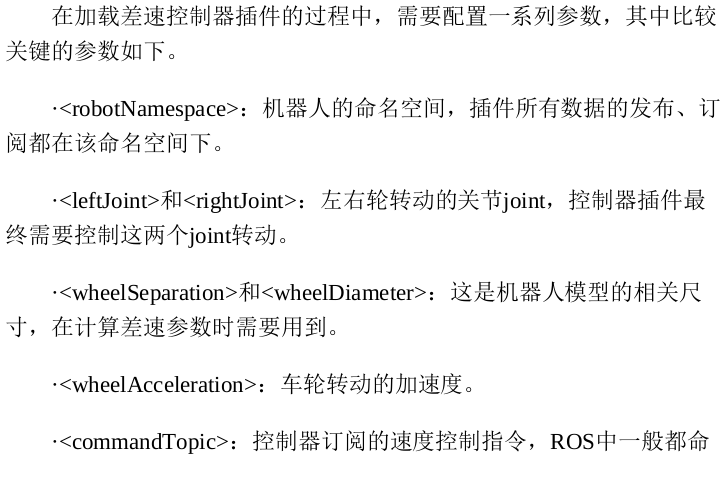
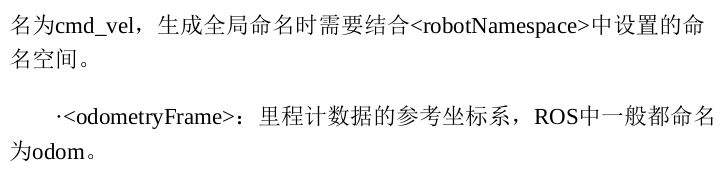
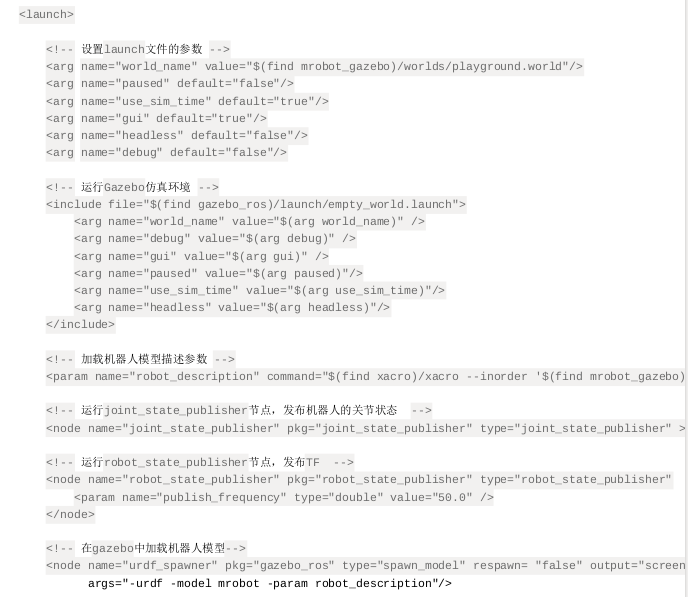

## 给模型添加Gazebo属性
**第一步**\
添加link的``<inertia>``标签
给每个必要的``<link> <joint> <robot>``设置``<gazebo>``标签\
\
每一个``<link>``的``<gazebo>``标签包含的属性只有material，需要将其设置与visual标签的参数相同（默认的模型为灰白色）\
\
**第二步**\
使用ROS差速驱动机器人，需要加入``<transmission>``

```xml
<transmission name="wheel_${lr}_joint_trans">
    <type>transmission_interface/SimpleTransmission</type>
    <joint name="base_to_wheel_${lr}_joint" />
    <actuator name="wheel_${lr}_joint_motor">
        <hardwareInterface>VelocityJointInterface</hardwareInterface>
        <mechanicalReduction>1</mechanicalReduction>
    </actuator>
</transmission>
```
``<hardwareInterface>``标签定义了硬件接口的类型，这里使用的是速度控制接口\
\
**第三步**\
添加控制器插件，使用``<gazebo>``标签进行封装;支持的插件类型在/opt/ros/melodic/lib文件夹，以libgazeboXXX.so的形式命名
```xml
<gazebo>
    <plugin name="unique_name" filename="plugin_name.so">
        ... plugin parameters ...
    </plugin>
</gazebo>

<gazebo reference="your_link_name">
    <plugin name=" unique_name " filename="plugin_name.so">
        ... plugin parameters ...
    </plugin>
</gazebo>
```

```xml
<gazebo>
    <plugin name="differential_drive_controller" filename="libgazebo_ros_diff_drive.so">
        <rosDebugLevel>Debug</rosDebugLevel>
        <publishWheelTF>true</publishWheelTF>
        <robotNamespace>/</robotNamespace>
        <publishTf>1</publishTf>
        <publishWheelJointState>true</publishWheelJointState>
        <alwaysOn>true</alwaysOn>
        <updateRate>100.0</updateRate>
        <legacyMode>true</legacyMode>
        <leftJoint>base_to_wheel_left_joint</leftJoint>
        <rightJoint>base_to_wheel_right_joint</rightJoint>
        <wheelSeparation>${base_link_radius*2}</wheelSeparation>
        <wheelDiameter>${2*wheel_radius}</wheelDiameter>
        <broadcastTF>1</broadcastTF>
        <wheelTorque>30</wheelTorque>
        <wheelAcceleration>1.8</wheelAcceleration>
        <commandTopic>cmd_vel</commandTopic>
        <odometryFrame>odom</odometryFrame>
        <odometryTopic>odom</odometryTopic>
        <robotBaseFrame>base_footprint</robotBaseFrame>
    </plugin>
</gazebo>
```



**launch文件解释**
